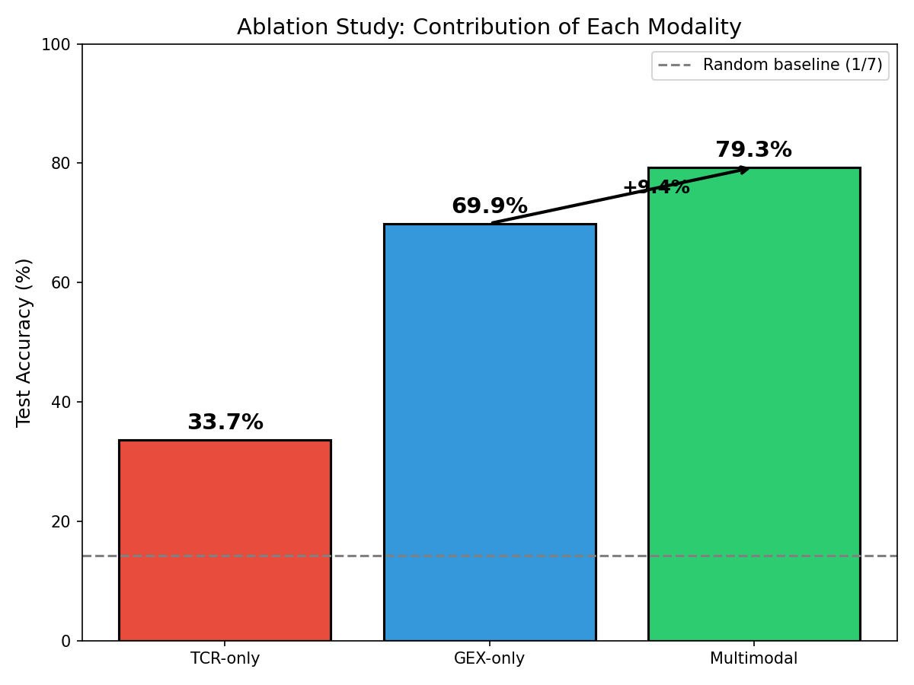
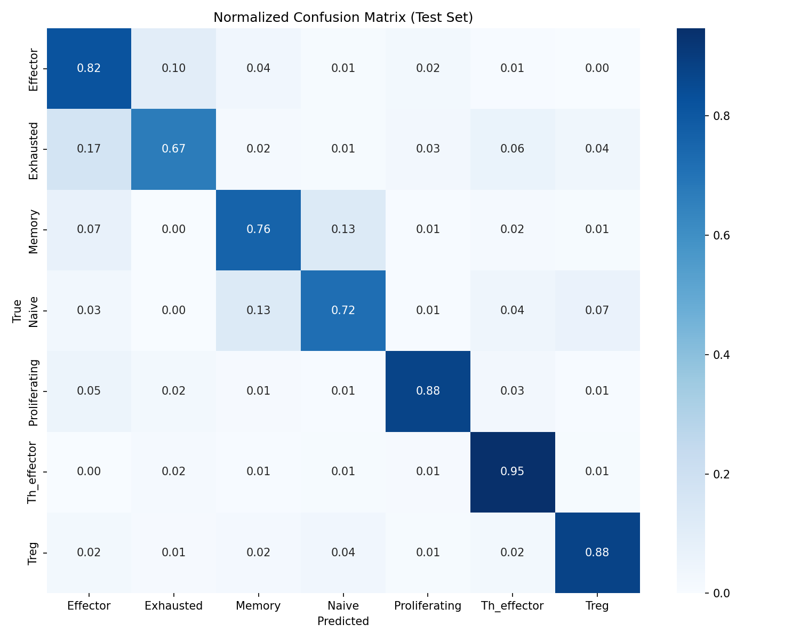
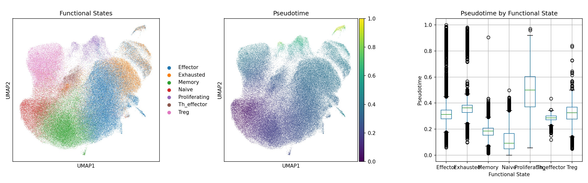

# Multimodal T-Cell Functional State Classifier

[](https://www.python.org/downloads/)
[](https://pytorch.org/)
[](https://opensource.org/licenses/MIT)

A deep learning model for predicting T-cell functional states by integrating TCR sequences and gene expression profiles.

## Overview

This project implements a multimodal neural network that combines:
- **TCR sequences** encoded via TCR-BERT (768-dimensional embeddings)
- **Gene expression** profiles (50-dimensional PCA from scRNA-seq)

The model performs multiple tasks:
1. **Classification** of 7 functional states (79.3% accuracy)
2. **Activation probability** prediction (R²=0.61)
3. **Behavior clustering** (22 data-driven clusters)
4. **Trajectory reconstruction** via diffusion pseudotime

## Key Results

### Ablation Study

| Model | Test Accuracy |
|-------|---------------|
| TCR-only | 33.7% |
| GEX-only | 69.9% |
| **Multimodal** | **79.3%** |

**+9.4% improvement** from multimodal integration.



### Classification Performance

| Class | F1-Score | Support |
|-------|----------|---------|
| Treg | 0.87 | 2,329 |
| Effector | 0.84 | 6,685 |
| Memory | 0.80 | 4,979 |
| Proliferating | 0.77 | 764 |
| Naive | 0.70 | 2,441 |
| Exhausted | 0.67 | 2,245 |
| Th_effector | 0.61 | 393 |



### Trajectory Analysis

The model's latent space preserves biological trajectory:
**Naive → Memory → Effector → Exhausted**



## Architecture
```
┌─────────────┐     ┌─────────────┐     ┌─────────────┐
│   GEX (50)  │     │ TCR-α (768) │     │ TCR-β (768) │
└──────┬──────┘     └──────┬──────┘     └──────┬──────┘
       │                   │                   │
       ▼                   ▼                   ▼
┌──────────────┐    ┌──────────────┐    ┌──────────────┐
│ GEX Encoder  │    │ TCR-α Encoder│    │ TCR-β Encoder│
│  50→128→256  │    │ 768→256→256  │    │ 768→256→256  │
└──────┬───────┘    └──────┬───────┘    └──────┬───────┘
       │                   │                   │
       └───────────────────┼───────────────────┘
                           │
                           ▼
                  ┌─────────────────┐
                  │ Concat (768-dim)│
                  └────────┬────────┘
                           │
              ┌────────────┴────────────┐
              │                         │
              ▼                         ▼
     ┌─────────────────┐      ┌─────────────────┐
     │   Classifier    │      │    Regressor    │
     │   768→256→7     │      │    768→256→1    │
     └─────────────────┘      └─────────────────┘
              │                         │
              ▼                         ▼
       Functional State          Activation Score
```

## Installation
```bash
# Clone repository
git clone https://github.com/polinavd/multimodal-tcell-classifier.git
cd multimodal-tcell-classifier

# Create environment
conda create -n tcell python=3.10
conda activate tcell

# Install PyTorch (with CUDA for GPU)
pip install torch torchvision torchaudio --index-url https://download.pytorch.org/whl/cu121

# Install dependencies
pip install -r requirements.txt
```

## Data

The model was trained on **136,667 T-cells** from 4 public datasets:
- GSE144469 (Colitis, 60k cells)
- GSE179994 (PBMC exhaustion, 77k cells)
- GSE181061 (ccRCC TILs, 31k cells)

### Data Preparation

TCR sequences were unified across datasets and encoded using [TCR-BERT](https://github.com/wukevin/tcr-bert).

## Usage

### Training
```bash
# Basic model
python src/train.py --config configs/default.yaml

# Advanced model with cross-attention
python src/train.py --config configs/advanced.yaml --device cuda
```

### Inference
```python
from src.models import MultimodalTCellClassifier
import torch

# Load model
model = MultimodalTCellClassifier()
model.load_state_dict(torch.load('results/best_model.pt'))
model.eval()

# Predict
with torch.no_grad():
    predictions = model(gex, tcr_alpha, tcr_beta)
    functional_state = predictions.argmax(dim=1)
```

## Project Structure
```
multimodal-tcell-classifier/
├── src/
│   ├── models/          # Neural network architectures
│   ├── data/            # Data loading and preprocessing
│   ├── utils/           # Metrics and visualization
│   └── train.py         # Training script
├── configs/             # Training configurations
├── notebooks/           # Jupyter notebooks
├── results/figures/     # Generated figures
├── requirements.txt
└── README.md
```

## Citation

If you use this code, please cite:
```bibtex
@software{shirokikh2025multimodal,
  author = {Shirokikh, Polina},
  title = {Multimodal T-Cell Functional State Classifier},
  year = {2025},
  url = {https://github.com/polinavd/multimodal-tcell-classifier}
}
```

## Acknowledgments

- [TCR-BERT](https://github.com/wukevin/tcr-bert) for TCR sequence encoding
- Public datasets from GEO (GSE144469, GSE179994, GSE181061)

## License

MIT License - see [LICENSE](LICENSE) for details.

## Author

**Polina Shirokikh**  
Master's Thesis Project, 2025
